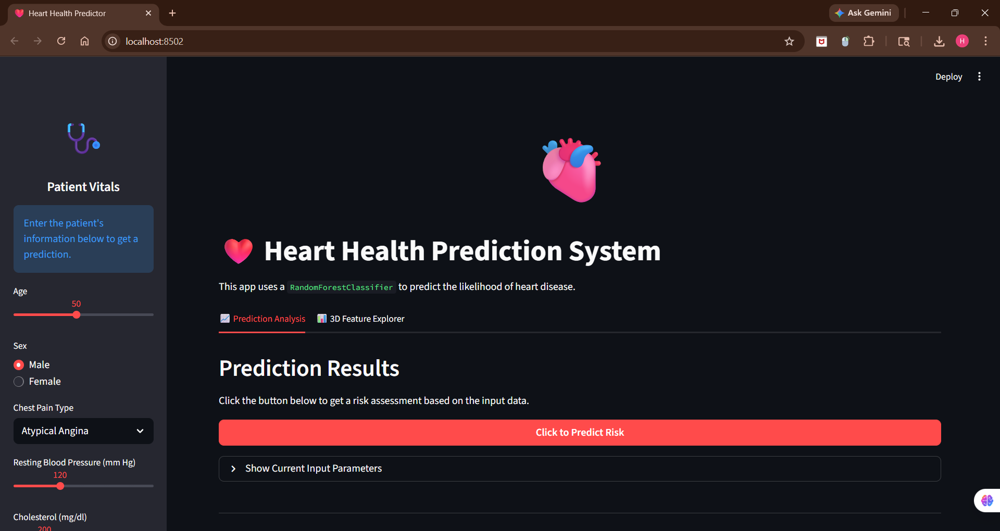
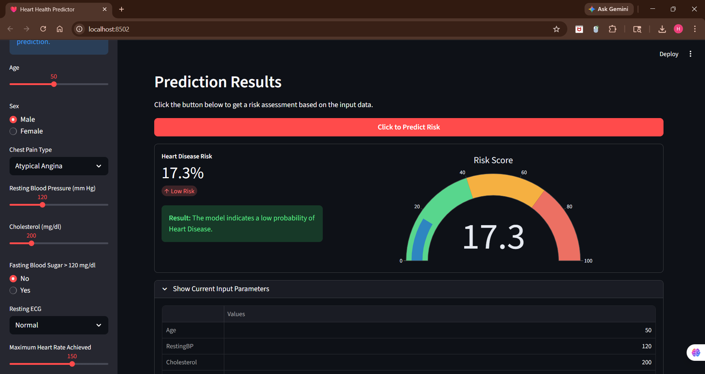
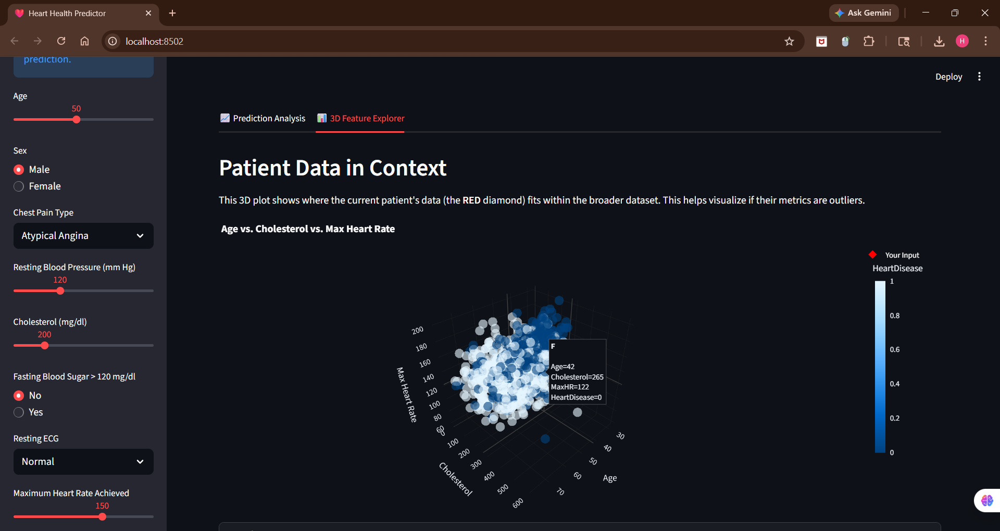
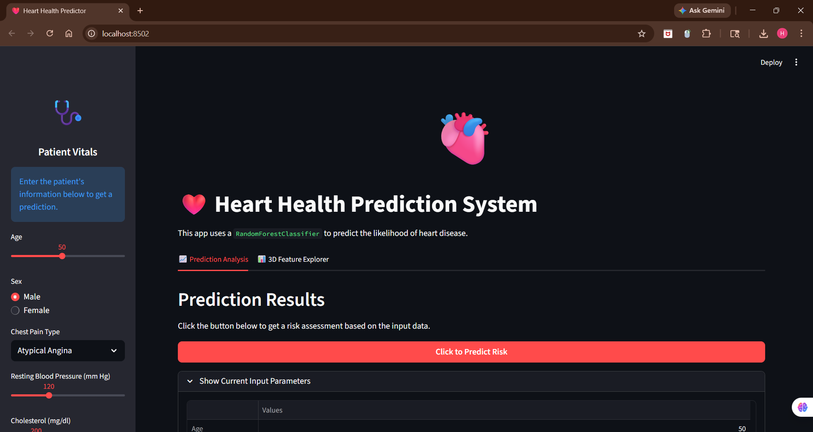

# Heart-Health-Prediction-System-Project

# ❤️ Heart Health Prediction System — Machine Learning Web App

🚀 A smart ML-based web application that predicts the risk of heart disease using patient health parameters.

---

## 🎥 Demo Video
👉[![Watch Demo] https://drive.google.com/file/d/1PU4dIYGPBBI9Jzfq332o644D8WJoKeqC/view?usp=sharing
---

## 🧠 Problem Statement
Heart disease is one of the leading causes of death.  
This system helps in **early prediction of risk** using Machine Learning.

---

## ⚙️ Tech Stack
- 🐍 Python  
- 📊 Pandas, NumPy  
- 🤖 Scikit-learn (Random Forest)  
- 📈 Plotly (Visualization)  
- 🌐 Streamlit  

---

## 🚀 Features
✅ Predict heart disease risk (High/Low)  
✅ Shows probability score (%)  
✅ Interactive user interface  
✅ 3D data visualization  

---

## 🧪 Sample Input

---

## 📊 Model Details
- Algorithm: Random Forest  
- Accuracy: ~86%  
- Preprocessing: One-Hot Encoding  

---
## Output

## 📈 3D Visualization

👉 This plot shows:
- Age vs Cholesterol vs Max Heart Rate  
- Red point = Current user input  

---

## 📸 Application Screenshot

---

## 💡 Real-World Applications
- 🏥 Hospitals & clinics  
- 📱 Health monitoring apps  
- 🧑‍⚕️ Decision support systems  

---

## ⚠️ Disclaimer
❗ This is not a medical diagnosis tool.  
Always consult a doctor.

---

## ⭐ Conclusion
This project demonstrates my ability to build and deploy an **end-to-end Machine Learning system with visualization and UI integration**.

## 💼 Author
👨‍💻 Himanshu Anand
